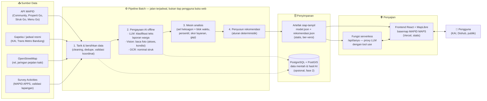
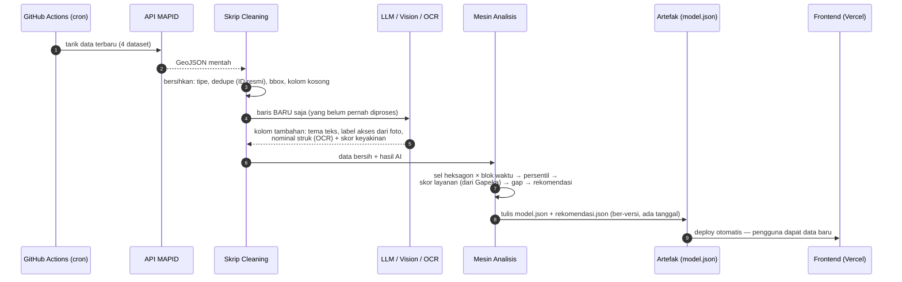
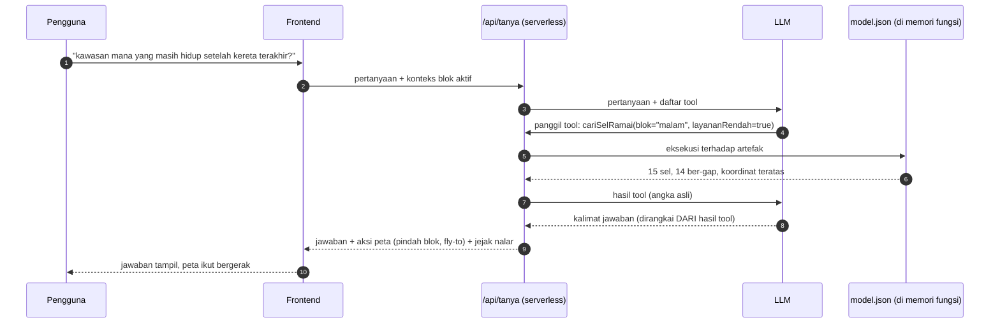

# ARSITEKTUR.md — Rancangan Implementasi SIMPUL

> Arsitektur untuk **tahap implementasi penuh** (setelah lolos 50 besar, saat data API MAPID terbuka). Diagram ditulis dengan Mermaid — GitHub me-render-nya otomatis; bisa juga di-paste ke mermaid.live atau FigJam untuk diekspor jadi gambar proposal.
>
> Prinsip besarnya satu: **kerja berat dilakukan di belakang secara berkala (batch), browser hanya menampilkan hasil jadi.** Ini yang membuat WebGIS-nya tetap ringan (syarat lomba: loading wajar) walau datanya membesar.

---

## 1. Gambaran besar

Tiga zona, tiga ritme:

| Zona | Jalan kapan | Teknologi |
|---|---|---|
| **Pipeline batch** | Terjadwal (mis. tiap malam / tiap data baru masuk) via GitHub Actions cron | Skrip Node.js/Python |
| **Penyimpanan** | Artefak diganti tiap pipeline selesai | File JSON statis (fase 1) → PostGIS (fase 2) |
| **Penyajian** | Real-time saat pengguna membuka web | React + MapLibre di Vercel + fungsi serverless |

---

## 2. Kenapa dipisah begini (alasan yang bisa dipakai jawab juri)

**Kenapa AI-nya offline/batch, bukan tiap kali web dibuka?**
Membaca 1.000+ foto dan mengklasifikasi ribuan teks itu mahal dan lambat. Dilakukan **sekali per pembaruan data**, hasilnya disimpan sebagai kolom baru. Pengguna tidak pernah menunggu AI — mereka menerima hasil yang sudah jadi dan sudah divalidasi. Bonus: hasil AI bisa diaudit dulu sebelum tayang.

**Kenapa hasil analisis disimpan sebagai file statis, bukan dihitung server tiap permintaan?**
Data kompetisi diperbarui berkala, bukan per detik. File statis = loading cepat, hosting gratis (Vercel), tidak ada server yang bisa tumbang saat dinilai juri. PostGIS baru masuk kalau kebutuhan nyata muncul (query lintas kota, data jutaan baris) — jangan bawa infrastruktur yang belum dibutuhkan.

**Kenapa asisten AI butuh fungsi serverless kecil?**
Dua alasan: kunci API LLM tidak boleh terlihat di browser, dan jawaban model harus **dipaksa lewat tool use** (model hanya boleh memanggil fungsi seperti `getNodeStats()` lalu merangkai kalimat dari hasilnya — tidak pernah menulis angka sendiri). Fungsi kecil ini satu-satunya komponen "backend" yang benar-benar diperlukan.

---

## 3. Detail pipeline batch

Catatan penting per langkah:

- **Langkah 4 (hemat biaya):** AI hanya memproses **baris baru** — hasil lama di-cache. Biaya LLM tidak membengkak seiring data tumbuh.
- **Langkah 5 (kejujuran):** setiap hasil AI membawa skor keyakinan + kelas "tidak ternilai". Sampel acak divalidasi manusia tiap siklus; angka akurasinya ikut disimpan di artefak dan **ditampilkan di tab Metode**.
- **Langkah 7 (dapat diaudit):** artefak ber-versi — kalau ada angka aneh di web, bisa dirunut ke pipeline run yang mana, data masuk yang mana.

---

## 4. Alur asisten AI (satu-satunya jalur real-time)

Kontrak kuncinya: **LLM tidak pernah diberi izin menulis angka bebas** — dia hanya boleh memanggil tool dan merangkai kalimat dari nilai yang dikembalikan. Prototipe sekarang sudah memakai kontrak yang sama (versi rule-based), jadi migrasinya cuma mengganti isi satu fungsi.

---

## 5. Peta migrasi: prototipe sekarang → implementasi penuh

| Komponen | Prototipe (sudah jalan) | Implementasi penuh | Effort |
|---|---|---|---|
| Sumber data | File sample statis di repo | API MAPID via pipeline | Kecil — adapter per dataset sudah ada |
| Cleaning | `engine.ts` di browser | Pindah ke skrip pipeline (logika sama, TypeScript bisa dipakai ulang langsung) | Kecil |
| Klasifikasi teks | Leksikon (rule-based) | LLM batch + validasi sampel | Sedang |
| Baca foto | 3 label manual (bukti konsep) | Vision model batch atas ribuan foto | Sedang–besar |
| Mesin analisis (hex, blok, persentil, gap) | `engine.ts` + `recommend.ts` | **Dipakai ulang apa adanya** di pipeline | Nol |
| Profil jadwal | Perkiraan kasar | Dihitung dari Gapeka resmi per stasiun | Kecil |
| Asisten | Rule-based di browser | LLM + tool use di serverless | Sedang |
| Peta & UI | React + MapLibre | **Sama** — tinggal ganti sumber ke artefak + basemap MAPID MAPS | Nol–kecil |
| Hosting | Lokal | Vercel (frontend + fungsi) + GitHub Actions (pipeline) — semua free tier | Kecil |

Poin jual ke juri: **mesin analisisnya tidak dibuang** — yang berubah hanya di mana dia dijalankan dan dari mana datanya. Prototipe ini bukan mockup; dia komponen produksi yang dipindah tempat.

---

## 6. Teknologi per komponen (buat Lampiran Assessment Tim)

| Komponen | Pilihan | Kenapa |
|---|---|---|
| Frontend | React 19 + TypeScript + Vite | Sudah jalan; ekosistem luas |
| Peta | MapLibre GL JS | Open source; kompatibel basemap MAPID MAPS |
| Pipeline | Node.js (pakai ulang engine TS) atau Python (kalau tim lebih nyaman untuk bagian AI) | Logika inti sudah ada dalam TS |
| AI teks & foto | LLM multimodal via API, batch | Sekali per siklus, murah, hasil di-cache & divalidasi |
| Analisis spasial berat (network analysis pejalan kaki) | QGIS (offline) → hasil diekspor GeoJSON ke pipeline | Sesuai anjuran panitia soal tools open-source |
| Penyimpanan fase 1 | Artefak JSON statis ber-versi | Cepat, gratis, cukup untuk satu kota |
| Penyimpanan fase 2 | PostgreSQL + PostGIS | Saat multi-kota / query kompleks |
| Serverless | Vercel Functions | Satu platform dengan hosting; gratis |
| Penjadwal | GitHub Actions cron | Gratis, log-nya publik & bisa diaudit |
| Deploy | Vercel, publik | Syarat final lomba |

---

## 7. Hal yang sengaja TIDAK ada di arsitektur ini

1. **Tidak ada server yang selalu menyala** — tidak ada yang perlu dijaga, tidak ada biaya bulanan, tidak ada titik gagal saat juri membuka web.
2. **Tidak ada AI real-time di jalur data** — AI yang menyentuh data selalu batch + tervalidasi. Satu-satunya AI real-time adalah asisten, dan dia dikurung tool use.
3. **Tidak ada microservices** — untuk skala lomba (satu kota, data ribuan baris), monolit pipeline + frontend statis adalah arsitektur yang *benar*, bukan kompromi. Kompleksitas harus dibayar oleh kebutuhan, bukan gengsi.
