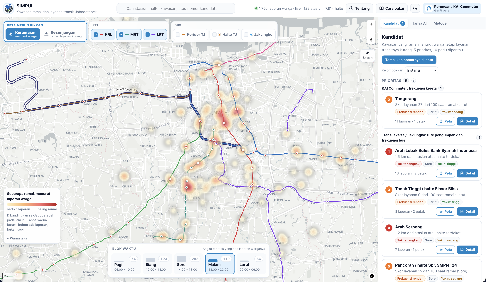

# SIMPUL 🚈



**Peta kapan kota hidup, dan apakah transportasi massalnya hadir pada jam itu. Jabodetabek.**
Prototipe WebGIS tim COOK untuk MAPID WebGIS Competition 2026 (_Maps That Think! Mass Transportation Edition_).

🔗 **Coba langsung:** [simpul-webgis.vercel.app](https://simpul-webgis.vercel.app/)

> Kota punya denyut: ramai jam sekian, sepi jam sekian. SIMPUL membacanya dari laporan lapangan warga di Community Maps MAPID, lalu menabrakkannya dengan layanan transit yang benar-benar ada: stasiun, halte, dan jadwalnya. Hasilnya: peta yang bisa digeser per blok waktu, kawasan "ramai tapi tak terlayani" tersorot otomatis, dan daftar kandidat berperingkat untuk KAI Commuter, TransJakarta, dan Dishub.

## Fitur

### Peta

- 🔥 **Keramaian** — heatmap kegiatan warga, berubah jadi petak heksagon 500 m saat diperbesar, digeser lima blok waktu (pagi sampai larut)
- 🚨 **Kesenjangan** — hanya kawasan ramai yang layanannya kurang: merah tak terjangkau, oranye frekuensi rendah, kuning perlu dipantau
- 🗺 **Jalur berwarna** — KRL per lintas, MRT, LRT dari relasi OSM; koridor BRT TransJakarta dari GTFS resmi
- 🌓 **Basemap MAPID MAPS** — terang, gelap, satelit; responsif desktop dan ponsel

### Kandidat & usulan

- 📋 **Kandidat berperingkat, dua tingkat** — petak bermasalah yang bersebelahan digabung jadi kandidat prioritas atau perlu dipantau, lengkap dengan bukti, jarak, blok dominan, dan keyakinan; bisa dikelompokkan per instansi, jenis, blok waktu, atau keyakinan
- 🛠 **Usulan tindakan per kandidat** — langkah konkret dan angka indikatif (tambahan keberangkatan, jeda antar keberangkatan, perkiraan armada), tiap angka punya tombol "i" berisi cara hitungnya

### Asisten AI

- 💬 **Tanya AI** — Gemini dengan _function calling_ memilih alat (ringkasan kota, petak ramai, daftar/detail/banding kandidat, profil kawasan, gerakkan peta); setiap angka tetap dijalankan mesin hitung di browser, bukan dikarang model
- 🧭 **Jejak jawaban** ditulis bahasa biasa, bukan dump nama fungsi; tanpa kunci API atau kalau Gemini gagal dihubungi, otomatis jatuh ke mode aturan dengan alasannya ditulis terbuka

### Akses

- 👥 **Login berbasis peran** (dummy, tanpa kata sandi) — Perencana KAI Commuter dan Analis Jaringan TransJakarta hanya melihat kandidat milik instansinya; Regulator Dishub dan Tamu melihat semuanya
- 🔎 **Cari lokasi** — stasiun, halte, nomor kandidat, atau nama tempat lewat geocoder Nominatim (OSM), dibatasi Jabodetabek
- ✨ **Pengenalan dua tab** ("Apa itu SIMPUL" dan "Cara pakai") muncul di kunjungan pertama, bisa dibuka lagi lewat topbar

## Data (semua nyata, tidak ada dummy)

| Data                                                             | Sumber                                                                                                                                    |
| ----------------------------------------------------------------- | ------------------------------------------------------------------------------------------------------------------------------------------ |
| Laporan warga Community Maps, 1.750 di Jabodetabek (9 Sep 2026)  | **API kompetisi MAPID**, ditarik live per bbox lewat `/api/activities`; snapshot `src/data/activitiesJabodetabek.json` sebagai cadangan |
| 129 stasiun KRL/MRT/LRT + lintas; jalur rel                       | OpenStreetMap                                                                                                                             |
| Keberangkatan KRL per blok                                        | Gapeka 2025 / 2023, dibagi per blok dengan bobot headway                                                                                  |
| MRT & LRT                                                         | Headway resmi operator                                                                                                                    |
| 7.814 halte TransJakarta & JakLingko + keberangkatan per blok     | GTFS resmi TransJakarta                                                                                                                   |

Tidak ada perkiraan keramaian untuk kawasan tanpa laporan, ditampilkan "belum ada data" (sesuai PRD). Struk Go / Menu Go / Properti Go menyusul lewat endpoint _Missions_ MAPID.

## Menjalankan

```bash
npm install
```

1. Salin `.env.example` ke `.env.local`.
2. Isi `VITE_MAPID_API_KEY` (Dashboard MAPID → Map Services → API Keys) — dipakai untuk basemap dan, lewat proxy dev di `vite.config.ts`, untuk API Activities.
3. Isi `VITE_GEMINI_API_KEY` (aistudio.google.com, free tier) supaya tab **Tanya AI** memakai Gemini. Tanpa kunci, asisten memakai mode aturan.
4. `VITE_GEMINI_FALLBACK_MODEL` opsional, untuk model cadangan kalau model utama sedang sibuk.

```bash
npm run dev
```

### Deploy (Vercel)

`api/activities.ts` adalah Edge Function yang meneruskan permintaan ke server MAPID (endpoint itu menolak panggilan langsung dari browser). Set **`MAPID_API_KEY`**, `VITE_MAPID_API_KEY`, dan `VITE_GEMINI_API_KEY` di Environment Variables proyek. `vercel.json` sudah mengecualikan `/api/` dari rewrite SPA.

## Dokumentasi

| Dokumen                              | Isi                                                                                                     |
| ------------------------------------- | ----------------------------------------------------------------------------------------------------- |
| **[CARA-KERJA.md](CARA-KERJA.md)**   | Dari layar ke angka: apa yang dilihat, dari mana datanya, cara membaca satu kartu kandidat, rencana AI |
| **[PERHITUNGAN.md](PERHITUNGAN.md)** | Rumus langkah demi langkah + alasan tiap bobot/ambang                                                  |
| **[ARSITEKTUR.md](ARSITEKTUR.md)**   | Rancangan implementasi penuh (pipeline, PostGIS, backend, diagram)                                     |
| **[IDE-UTAMA.md](IDE-UTAMA.md)**     | Ide awal dalam bahasa sederhana                                                                        |
| **[TECHNOLOGY.md](TECHNOLOGY.md)**   | Draf bab kelayakan teknis proposal                                                                     |

## Stack

React 19 + TypeScript + Vite · MapLibre GL JS v5 · analisis spasial ditulis manual (haversine, grid heksagon, flood-fill) supaya rumusnya terlihat dan bisa diaudit · Vercel Edge Function sebagai backend tipis.

## Batasan

Sebaran laporan mengikuti lokasi surveyor (bukan sampel acak); jam laporan condong 12 sampai 17 WIB; timetable KRL per stasiun belum terbuka; peran memfilter kandidat mana yang bisa dilihat, tetapi tanpa autentikasi sungguhan, siapa saja bebas memilih peran apa saja. Daftar lengkap ada di tab **Metode** dalam aplikasi.
